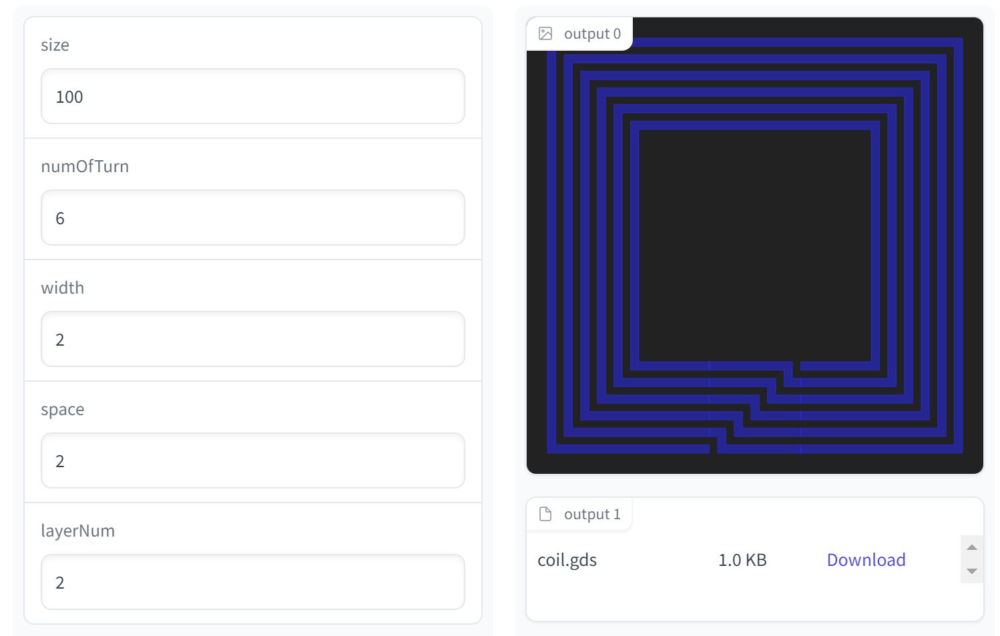

# On-chip coil generator
On-chip coil generator is a script for generating GDSII layout files of on-chip spiral coils. It also calculates the inductance values of the generated coils.

### Web demo

## Getting Started
By specifying some input values (size, n, w[um], s[um]) and the layer number of an output GDSII file, you can get a vector image file (coil.svg) and a GDSII layout file (coil.gds).

### Prerequisites
- gdspy

## License
This project is licensed under the MIT License - see the [LICENSE](LICENSE) file for details
